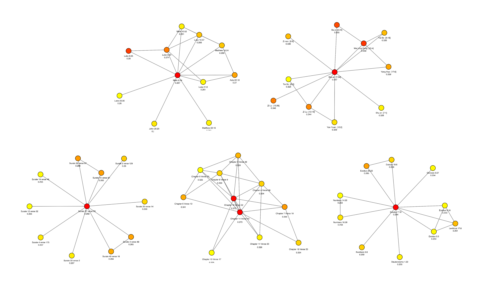

# RAGenesis



Using Retrieval-Augmented Generation (RAG) technology, RAGenesis empowers users to engage with scripture in an ecumenical and transformative way. 

Explore the holy texts of the **Bible**, the **Quran**, the **Bhagavad Gita**, and the **Analects** with the help of AI!

## Table of Contents

- [Project Goals](#installation)
- [Installation](#installation)
- [Contributing](#contributing)
- [License](#license)
- [Credits and Contact Information](#contact-information)


## Project Goals

* Send a message of unity and mutual understanding between different cultures through a “generative book” compiling the wisdom of many different traditions.

* Develop a framework for transparency of embedded knowledge bases and evaluation of main messaging in a RAG application.

* Define Semantic Similarity Networks as a special case of Semantic Networks and derive Main Chunk methodology based on elementary Graph theory.

* Create a showcase of my technical capacity as an AI engineer, data scientist, product designer, software developer and writer.

* Make something cool.

Make sure to read the original article that produced this work, where a reasonably complete description of general ideas behind this application is exposed:

https://www.lesswrong.com/posts/rLQGD63B2znREaaP7/retrieval-augmented-genesis 

## Installation

This application is designed to run on AWS cloud. Before deploying, ensure you have the following:

- A dedicated endpoint from Hugging Face for the model `all-MiniLM-L6-v2`. [Model Link](https://huggingface.co/sentence-transformers/all-MiniLM-L6-v2)
- Hugging Face API key.
- A Jina AI key for `jina-clip-v1`. [Jina AI Embeddings](https://jina.ai/embeddings/)

Save these as parameters in AWS SSM Parameter Store with the respective names:

- `hf_api_endpoint`
- `hf_api_key`
- `jina_api_key`

if needed, check session_state_schema.md file for all streamlit session state variables description.

### Deployment Steps

1. Navigate to the directory for the CloudFormation template:

   ```bash
   cd infra/cf-template/app-vectordb
   ```


2. Build and deploy the SAM application:

    ```bash
    sam build
    sam deploy --guided
    ```

3. During cf stack guided deployment:

* Select a c5.xlarge instance.
* Use the correct name for an EC2 KeyPair to access your instance.

4. This deployment will provision your EC2 instance with ECR permissions and install a Milvus standalone instance in a container.

5. GitHub Actions should have already pushed your Docker image to ECR (see deploy.yml workflow).

6. Run the script vectordb_load.py in the src folder to load embeddings into your Milvus VectorDB already running on EC2. Ensure load_embeddings_boolean is set to True after the initial run and local save of embeddings.

7. Set the following variables in deploy/makefile for AWS and ECR:

* AWS_NAME
* IMAGE_NAME
* CONTAINER_NAME
* AWS_ACCESS_KEY_ID
* AWS_SECRET_ACCESS_KEY
* SSH Configuration
* SSH_USER
* EC2_HOST
* SSH_KEY_PATH

8. Application deployment:

    ```bash
    cd deploy
    make deploy
    ```

## Contributing

RAGenesis welcomes contributions! To get started:

* Fork the repository and clone it to your machine.
* Create a new branch for your feature or fix.
* Make your changes and commit them.
* Push your changes to your fork.
* Open a pull request with a description of what you've done.

## License

This project is licensed under the MIT License. See the [LICENSE](LICENSE) file for details.

## Credits

This is an original initiative by Joao Ribeiro Medeiros, see my personal page here:

https://joaoribeiromedeiros.github.io/


**Enjoy your journey!**           

*Connect past and future to create the present!*


